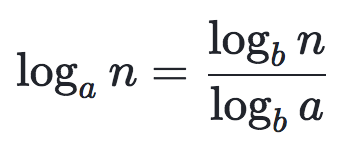
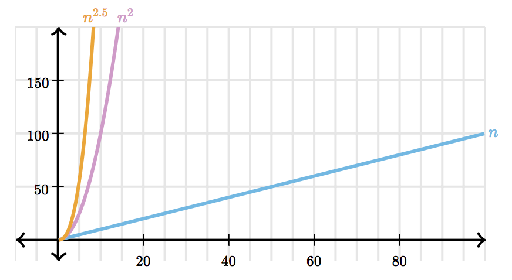
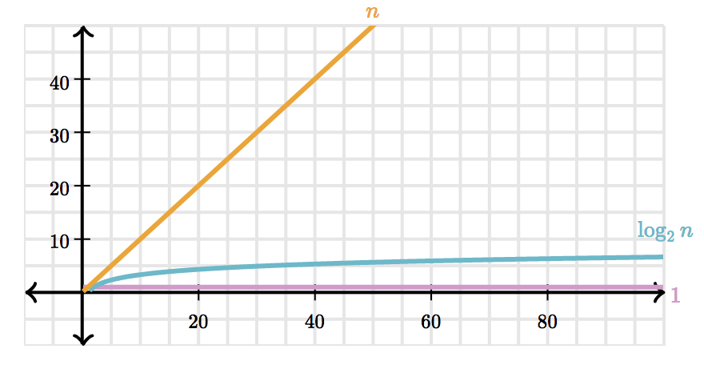

# 함수의 증가
- 입력이 충분히 커지면 수행시간 증가의 차수만 중요해진다.
- 알고리즘의 점근적 효율성을 판단할 수 있는 표기법을 살펴본다.
- 알고리즘 분석에 자주 등장하는 함수의 특성을 살펴본다.

## 알고리즘의 수행시간과 점근적 표기법
- 컴퓨터가 알고리즘을 실행하는 속도: CPU속도, 언어, 컴파일러 속도 등
- 알고리즘의 입력 크기: 배열의 크기, 데이터 타입 등
- 실행 시간의 성장률(rate of growth)
	- 입력의 크기에 따라 수행시간이 얼마나 증가하는가
	- 증가하는 비율이 중요하므로 계수와 최고차항이 아닌 항은 중요치 않음
- **점근적 표기법**
	- 성장률에만 집중해 불필요한 항과 계수를 삭제한 표기법
	- 작은 크기의 `n`에 대해선 무시.
	- 입력의 크기가 일정 이상 커지는 것에 대해 초점.
- Θ(log10 n)과 Θ(log2 n)처럼 로그의 밑이 상수라면 무엇이든 중요치 않다.

- 이는 모든 양수에 성립한다.

- 만일 `a`, `b`가 상수라면, logb a에 의해서만 달라지기 때문에 점근적 표기법에서 무시할 수 있는 상수이다.

### 알고리즘의 수행속도
- 자주 나오는 함수의 속도의 순서를 알아보자.
- `a` < `b`라면, Θ(na) < Θ(nb)

- Θ(log2n)은 Θ(n)보다 느리게 증가한다.

- 주로 사용하는 함수들의 속도 비교 (오름차순)
	1. Θ(1)
	2. Θ(log2n)
	3. Θ(n)
	4. Θ(nlog2n)
	5. Θ(n2)
	6. Θ(n2log2n)
	7. Θ(n3)
	8. Θ(2n)
	9. Θ(n!)

### Big-θ (빅 세타) 표기법
- 입력의 크기가 충분히 크다고 가정한다 (컴퓨터의 속도, 언어 등에 따라 바뀌는 상수 시간의 변화를 무시한다.)
- 알고리즘의 상한선과 하한선을 고려하는 표기법
- `n`의 크기가 충분히 크다면, 알고리즘의 수행속도는 **어느 순간**부터 k1 * n과 k2 * n 직선 사이에 끼이게 된다.

- 무조건 k1 * n과 k2 * n 직선 사이에 끼이게 되는 최솟점을 n0이라 하자.
- n0 보다 작은 값들은 입력이 충분히 크지 않으므로 무시한다.
- 그러므로 `running time`은 k1 * n, k2 * n 점근적으로 엄밀한 관계에 있다.
- **running time 은 음이 아니다라는 조건이 필요하다** (음이라면, 두 직선 사이에 끼이지 않게 된다.)
- n0, k1, k2 이 세 값을 선택할 수 있다 = **존재한다** 는 점에서 θ(n)으로 표기할 수 있다.

- `n`대신 `f(n)`에 대입할 수 있다.

